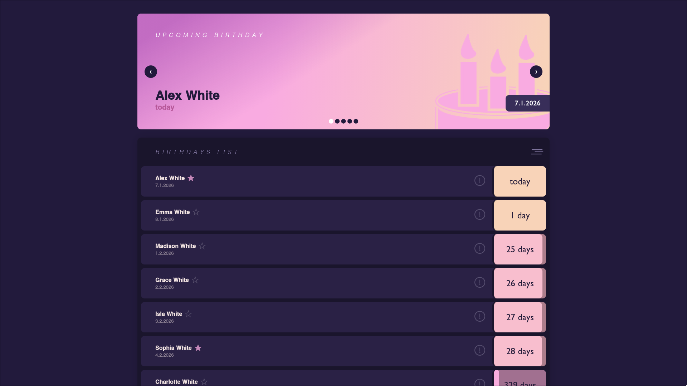
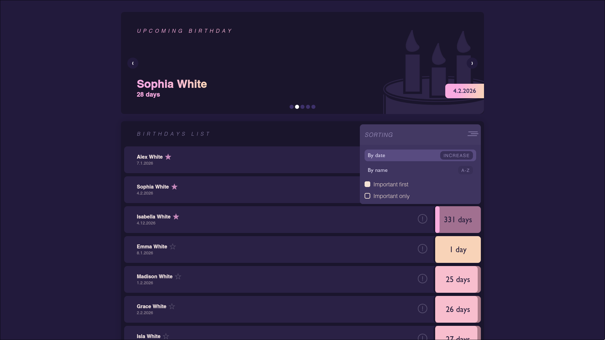

Live demo: [GitHub Pages link](https://moonimori.github.io/just-cake/)<br />
<span>Designed by <a href="https://github.com/empt1nesss">empt1nesss</a></span><br />

# Birthdays Web


A simple React application for storing and viewing birthdays of people you care about

## Screenshots

### Main view



### Options Menu



Live demo: [GitHub Pages link](https://moonimori.github.io/just-cake/)

## Overview

This project is a small React web app that lets you:

- Add people with their birthday dates
- View the full list of birthdays
- Keep track of upcoming birthdays

It’s designed for personal use and simple birthday tracking

## Features

- Add and store birthdays
- Display a list of saved entries
- Simple, intuitive user interface

## Tech Stack

- React
- JavaScript
- HTML & CSS

## How to run

1. Clone the repository:

```bash
git clone https://github.com/moonimori/birthdays-web.git
```

Move into the project directory:

```bash
cd birthdays-web
```

Install dependencies:

```bash
npm install
```

Start the development server:

```bash
npm start
```

Open your browser at http://localhost:3000
